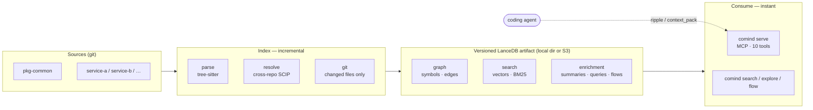

<p align="center">
  <picture>
    <source media="(prefers-color-scheme: dark)" srcset="assets/logo-dark.svg">
    
  </picture>
</p>

<h1 align="center">comind</h1>

<p align="center"><b>Deterministic, always-fresh, cross-repo code intelligence for coding agents — self-hosted, single binary.</b></p>

<p align="center">
  <a href="https://github.com/sayef/comind/actions/workflows/ci.yml"></a>
  <a href="LICENSE"></a>
  <a href="https://www.rust-lang.org"></a>
  <!-- After `cargo publish`, add: <a href="https://crates.io/crates/comind"></a> -->
</p>


Comind indexes a whole team's repositories into one versioned knowledge graph, then serves it to
coding agents (Claude Code, Cursor, …) over MCP. Unlike grep or per-repo search, it answers
*structural, cross-repo* questions deterministically:

- **Who breaks if I change this?** — org-wide blast radius (`ripple`)
- **What's the minimal context to change X safely?** — token-budgeted read-set (`context_pack`)
- **How does this flow work?** — a call-trace walkthrough (`flow`)
- **Where across the org is this used / how do I …?** — hybrid search + a pre-generated question catalog

Written in Rust. One static binary. No server to run, no per-developer re-indexing.

## Why it's different

- **Deterministic graph, not fuzzy RAG.** Calls, imports, and containment come from the AST
  (tree-sitter) — exact, reproducible, cheap to build.
- **Cross-repo by design.** A global symbol identity (SCIP scheme) links a definition in one repo to
  its users in every other. `ripple` gives blast radius across the whole org.
- **Built once, read everywhere.** CI builds a new atomically-versioned index (local dir or S3);
  every agent reads the same fresh artifact. Incremental — only changed files/symbols are recomputed.
- **Graph-aware hybrid search.** Local static embeddings (Model2Vec) + BM25 + a dependency-graph
  **centrality** signal no pure search tool has.
- **Provider-agnostic LLM enrichment.** Optional summaries, question catalogs, and flow walkthroughs
  via [Rig](https://github.com/0xPlaygrounds/rig) — OpenAI, any OpenAI-compatible endpoint, or a
  local model.

## Install

Prebuilt binaries (macOS arm64/x64, Linux x64/arm64) are published to
[GitHub Releases](https://github.com/sayef/comind/releases) on each `vX.Y.Z` tag:

```bash
curl -LsSf https://raw.githubusercontent.com/sayef/comind/main/scripts/install.sh | sh
```

Or from source (needs Rust — pinned via `rust-toolchain.toml` — plus `protoc` and `cmake`):

```bash
git clone https://github.com/sayef/comind && cd comind
cargo build --release      # → target/release/comind

# Try the deterministic engine on any repo, no network/S3 needed:
cargo run --example index_and_search -- ../some-repo
```

## Quick start

Zero-config: with no `--index-dir`, comind reads and writes a default index location
(`~/.local/share/comind`, XDG-aware — see `comind config path`).

```bash
comind index .                          # index this repo → default index dir (embeds by default)
comind search "how do we connect to postgres"   # search it, no path needed
comind serve                            # MCP server over the default index
```

Explicit location — a local dir or `s3://…`, shared across a team. The **same `--index-dir`**
builds and reads it (comind manages the internal dataset layout):

```bash
# 1. Build the org index from several repos, with embeddings + full enrichment
comind link ../pkg-common ../service-a --index-dir ./comind-index/org --enrich

# 2. Explore / search the prebuilt index (instant, no re-parse)
comind explore Settings --index-dir ./comind-index/org        # zoom + ripple + context pack
comind search  "how do we connect to postgres" --index-dir ./comind-index/org
comind flow    run_migrations --index-dir ./comind-index/org  # flow walkthrough + call trace

# 3. Serve it to an agent over MCP
comind serve --index-dir ./comind-index/org
```

Add to your MCP client (e.g. Claude Code):

```json
{
  "mcpServers": {
    "comind": {
      "command": "/path/to/comind",
      "args": ["serve", "--index-dir", "./comind-index/org"]
    }
  }
}
```

**MCP tools:** `search`, `suggest`, `repos`, `find`, `zoom`, `ripple`, `thread`, `flow`,
`context_pack`, `guide`. Results are handed to the agent as **markdown by default** (structured JSON
is also attached; use `serve --format json` for raw JSON).

## Commands

| Command | Purpose |
|---|---|
| `comind index <repo> [--enrich] [--flows] [--guide] [--no-embed] [--incremental]` | Index a single repo (embeds by default) |
| `comind link <repos…> [--enrich] [--flows] [--guide] [--no-embed] [--incremental]` | Link several repos (cross-repo edges + blast radius) |
| `comind explore <focus> [--index-dir <dir>]` | Zoom, blast radius, and context pack for a symbol |
| `comind search <query…> [--repo <name>] [--index-dir <dir>] [--format md\|table]` | Graph-aware hybrid code search |
| `comind find <query> [--repo <name>…] [--index-dir <dir>]` | Locate symbols by name/path substring |
| `comind repos [--index-dir <dir>]` | List indexed repositories + symbol counts |
| `comind stats [--repo <name>…] [--index-dir <dir>]` | Per-repo stats: symbols, edges, kinds, enrichment coverage |
| `comind guide [--repo <name>…] [-o <file>] [--index-dir <dir>]` | Per-repo inferred coding style guides (built with `--guide`) |
| `comind flow <focus> [--index-dir <dir>]` | Pre-generated flow walkthrough + live call trace |
| `comind changed <repo> [--since <sha>]` | Files changed since a commit (git diff) |
| `comind serve [--index-dir <dir>] [--format md\|json]` | MCP server over stdio |
| `comind config <path\|init>` | Show or scaffold the config file |

Run `comind <command> --help` for the full flags of any subcommand.

`--index-dir` is a local directory or an `s3://…` path; it is optional and defaults to the
configured index location. **Embeddings are built by default** (search works out of the box); pass
`--no-embed` for a faster structural-only index. `--enrich`/`--flows`/`--guide` are opt-in and send code
signatures to the configured LLM provider (see below); everything else stays local. Both cover the
**whole codebase** by default — set `max_enrich` / `max_flows` in `config.toml` to bound LLM cost.

## How it works

Build the index once (in CI or locally); every consumer reads the same versioned artifact.



Single crate, one module per stage — see [`ARCHITECTURE.md`](ARCHITECTURE.md) for the design and the
competitive landscape.

```
src/model.rs   SCIP identity, Symbol/Edge model
src/parse.rs   tree-sitter → symbols + intra-file edges (Python, TypeScript; polyglot-ready)
src/git.rs     git change detection (incremental)
src/resolve.rs cross-repo import/call binding
src/index.rs   versioned LanceDB store: symbols, edges, search, enrichment, flows, style guide
src/graph.rs   in-memory petgraph: ripple / thread / zoom / context_pack
src/embed.rs   Model2Vec embeddings + code-aware hybrid ranking
src/search.rs  hybrid retrieval (BM25 + vector + graph centrality)
src/llm.rs     LLM summaries / questions / flow walkthroughs (opt-in, provider-agnostic via Rig)
src/mcp.rs     MCP server (10 tools)
src/main.rs    the comind binary (CLI)
```

## CI

[`.github/workflows/comind-index.yml`](.github/workflows/comind-index.yml) (and
[`docs/CI.md`](docs/CI.md), with a GitLab variant) builds the shared index on a schedule: it clones
the listed repos and runs `comind link … [--enrich] [--incremental]`, publishing the result
as a downloadable artifact (or to S3). Lance's version manifest is the atomic "latest" pointer every
consumer reads.

## Configuration

Persistent, non-secret defaults live in `config.toml` (`comind config path` shows where; `comind
config init` scaffolds it). Precedence, highest first: **CLI flag → environment variable → config
file → built-in default**.

```toml
index_dir   = "~/.local/share/comind"   # default --index-dir (local path or s3://…)
llm_model   = "gpt-4o-mini"
embed_model = "minishlab/potion-base-8M"
format      = "md"    # default when --format is absent (search: md|table, serve: md|json)
# llm_base_url = "http://localhost:11434/v1"   # Ollama / vLLM / LiteLLM proxy
# max_enrich  = 200   # cap --enrich symbols (omit = no cap, whole codebase)
# max_flows   = 50    # cap --flows narrations (omit = no cap)
```

Environment overrides: `COMIND_INDEX_DIR`, `COMIND_LLM_MODEL`, `COMIND_EMBED_MODEL`,
`COMIND_LLM_BASE_URL`, `COMIND_FORMAT`.

**Secrets stay in the environment**, never the file: `--enrich`/`--flows` use an LLM via Rig
(default OpenAI, `OPENAI_API_KEY`; any OpenAI-compatible endpoint via `COMIND_LLM_BASE_URL`). For an
`s3://…` index, AWS credentials/region come from the standard AWS environment (`AWS_ACCESS_KEY_ID`,
`AWS_SECRET_ACCESS_KEY`, `AWS_REGION`, or an SSO profile).

## Status

Feature-complete: parse → resolve → index → graph → embed → enrich → search → serve, with
git-incremental indexing at repo and org level, hybrid search (BM25 + vector + centrality), flow
walkthroughs, and CI. Roadmap: more languages, native Bedrock/Vertex backends, and
`cargo install` / Homebrew packaging.

## Development

```bash
cargo test
cargo fmt --all
cargo clippy --all-targets -- -D warnings
```

Pre-commit hooks (fmt + clippy + basic file checks) live in `.pre-commit-config.yaml` — install
with `pre-commit install`, or the Rust-native `prek install` (both read the same file).

## License

MIT.

The logo mark is adapted from the [Phosphor Icons](https://phosphoricons.com) `graph` glyph (MIT).
