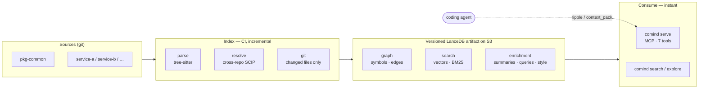

# Comind

**Deterministic, always-fresh, cross-repo code intelligence for coding agents — self-hosted, single binary.**

Comind indexes a whole team's repositories into one versioned knowledge graph on object storage,
then serves it to coding agents (Claude Code, Cursor, …) over MCP. Unlike grep or per-repo search,
it answers *structural, cross-repo* questions deterministically: **who breaks if I change this?**,
**what's the minimal context to change X safely?**, **where across the org is this used?**

Written in Rust. One static binary. No server to run, no per-developer re-indexing.

## Why it's different

- **Deterministic graph, not fuzzy RAG.** Calls/imports/inheritance come from the AST (tree-sitter),
  not from an LLM guessing — exact, reproducible, free to build.
- **Cross-repo by design.** Global symbol identity (SCIP scheme) links a definition in `pkg-common`
  to its users in every other repo. `ripple` gives org-wide blast radius.
- **Always fresh, shared once.** Push to master → CI builds a new atomically-versioned index on S3;
  every agent reads the same fresh artifact. Incremental: only changed files/symbols are recomputed.
- **Token-minimal answers.** `context_pack` returns the smallest correct read-set (personalized
  PageRank over the dependency graph) within a token budget — not a grep dump.
- **Graph-aware hybrid search.** Local static embeddings (Model2Vec) + lexical matching + a
  dependency-**centrality** signal no pure search tool has.

## Install

Prebuilt binaries (macOS arm64/x64, Linux x64/arm64) are published to
[GitHub Releases](https://github.com/sayef/comind/releases) by the
[`release`](.github/workflows/release.yml) workflow on each `vX.Y.Z` tag.

```bash
# One-line installer (set GITHUB_TOKEN while the repo is private)
curl -LsSf https://raw.githubusercontent.com/sayef/comind/main/scripts/install.sh | sh
```

Or build from source:

```bash
# Requires: Rust (pinned via rust-toolchain.toml), protoc, cmake  (`brew install protobuf cmake`)
git clone https://github.com/sayef/comind && cd comind
cargo build --release      # → target/release/comind

# See the deterministic engine (parse → resolve → graph → ripple) on any repo, no network/S3:
cargo run --example index_and_search -- ../some-repo
```

Coming once the repo is public: `cargo install comind` (crates.io) and a Homebrew tap.

## Quick start

```bash
# 1. Build the org index from several repos → local dir or S3, with embeddings + LLM enrichment
comind link ../pkg-common ../service-a ../service-b --to s3://my-bucket/comind/org --embed --enrich

# 2. Explore / search from the prebuilt index (instant, no re-parse)
comind explore Settings --from s3://my-bucket/comind/org/_graph      # zoom + ripple + context-pack
comind search  "how do we connect to postgres" --from s3://my-bucket/comind/org/_graph

# 3. Serve it to an agent over MCP
comind serve --from s3://my-bucket/comind/org/_graph
```

Add to your MCP client (e.g. Claude Code):

```json
{
  "mcpServers": {
    "comind": {
      "command": "/path/to/comind",
      "args": ["serve", "--from", "s3://my-bucket/comind/org/_graph"]
    }
  }
}
```

MCP tools: `search`, `suggest`, `repos`, `find`, `zoom`, `ripple`, `thread`, `flow`, `context_pack`, `guide`. Results are handed to the agent as **markdown by default** (structured JSON also attached; `comind serve --from <uri> --format json` for raw JSON).

## Commands

| Command | Purpose |
|---|---|
| `comind index <repo> --to <uri> [--incremental]` | Index one repo (git-incremental) |
| `comind link <repos…> --to <uri> [--embed] [--enrich] [--flows] [--incremental]` | Build the cross-repo org index |
| `comind changed <repo> --since <sha>` | Show files changed since a commit (git diff) |
| `comind explore <focus> --from <uri>` | Zoom, blast radius, context pack for a symbol |
| `comind search <query…> --from <uri> [--format md]` | Graph-aware hybrid code search |
| `comind flow <focus> --from <uri>` | Pre-generated flow walkthrough + live call trace |
| `comind serve --from <uri> [--format md|json]` | MCP server over stdio |

## CI (push-to-master → fresh org index)

See [`.github/workflows/comind-index.yml`](.github/workflows/comind-index.yml) and
[`docs/CI.md`](docs/CI.md) (GitLab variant included). The CI job clones the repos and runs
`comind link … --to s3://… --embed --enrich --incremental`; Lance's version manifest is the atomic
"latest" pointer every consumer reads. **LLM enrichment is opt-in** (`--enrich`) and sends code
signatures to the configured LLM provider (OpenAI by default, via Rig) only when enabled.

## Architecture

Build the index once in CI; every consumer reads the same versioned artifact.



Single crate, one module per stage — see [`ARCHITECTURE.md`](ARCHITECTURE.md) for the full design,
the competitive landscape, and the phase log.

```
src/model.rs   SCIP identity, Symbol/Edge model
src/parse.rs   tree-sitter → symbols + intra-file edges (Python, TypeScript; polyglot-ready)
src/git.rs     git change detection (incremental)
src/resolve.rs cross-repo import/call binding
src/index.rs   LanceDB (S3) versioned store: graph, embeddings, enrichment, style guide
src/graph.rs   in-memory petgraph: ripple / thread / zoom / context_pack
src/embed.rs   Model2Vec static embeddings + code-aware ranking
src/llm.rs     LLM summaries / query generation / style guide (opt-in, provider-agnostic via Rig)
src/mcp.rs     rmcp MCP server (7 tools)
src/main.rs    the `comind` binary (CLI)
```

## Status

Core complete (P0–P7): parse → resolve → index → graph → embed → enrich → search → serve, with
git-incremental indexing at both repo and org level, and CI. Roadmap: real BM25+RRF fusion, a Lance
ANN index for very large corpora, and `cargo install` / brew / curl packaging.

## License

MIT.
